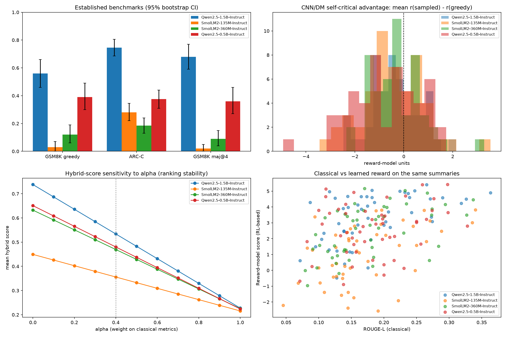
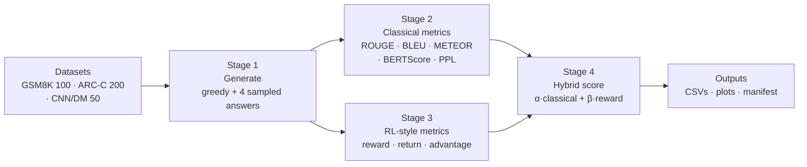
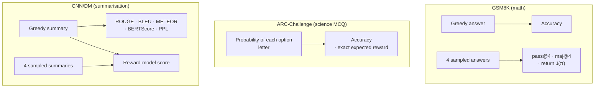
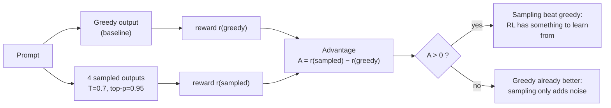
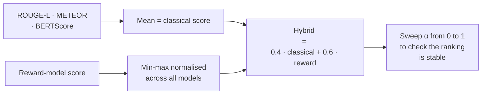
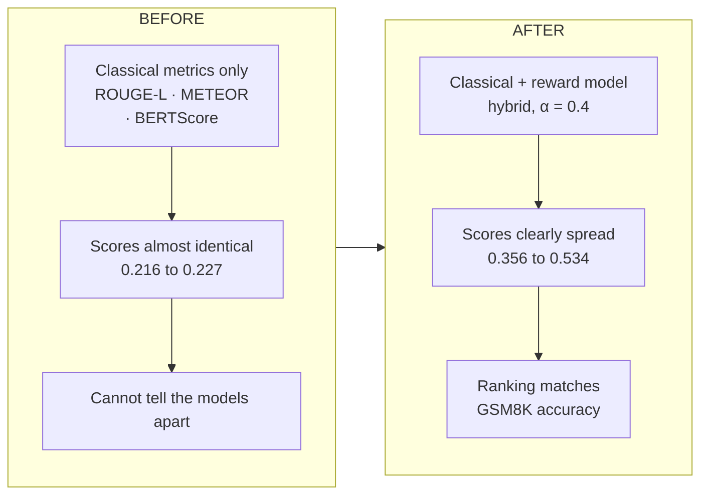
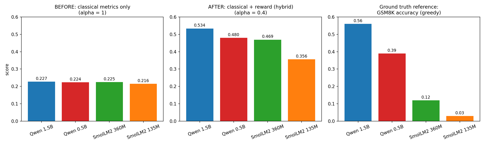

# LLM Evaluation: Benchmarks + Reward-Based (RL-Style) Metrics

## 1. What this project is about

**Goal:** compare small open LLMs in a fair, reproducible way, and check whether **classical metrics** (ROUGE, BLEU, accuracy) tell the same story as **reward-based metrics** (the signals used in RLHF / reinforcement learning).

**Questions we answer:**

1. Which model is best on math reasoning, science QA and summarisation?
2. Do classical metrics and reward metrics agree on the ranking?
3. Is sampling better than greedy decoding, or is there room to improve a model with RL-style training or test-time tricks (best-of-k, majority vote)?
4. Can a learned reward model be trusted as a stand-in for quality?

> **Note:** no model is trained or fine-tuned here. "RL-based" means the RL quantities (reward, return, advantage) are **measured on frozen models**. The results tell us *where* an optimization would help, not the effect of one.

**What this project supports, and what it does not claim**

| Supports                                                                               | Does not claim                                      |
| -------------------------------------------------------------------------------------- | --------------------------------------------------- |
| A systematic comparison of 4 LLMs on established benchmarks, with confidence intervals | Any training or fine-tuning of a model              |
| RL-style quantities (reward, return, advantage) used as evaluation metrics             | That the reward model is a perfect judge of quality |
| A reproducible pipeline (seed, run manifest, cached generations)                       | Results comparable with public leaderboards         |

---

## 2. Pipeline

### Data used

Test split, first N items of each dataset.

| Dataset             | Items | What the text is about                                                                   | What the model does                                      | How it is scored                                                       |
| ------------------- | ----- | ---------------------------------------------------------------------------------------- | -------------------------------------------------------- | ---------------------------------------------------------------------- |
| GSM8K               | 100   | Grade-school math word problems, with a step-by-step solution and a final numeric answer | Solves the problem step by step and gives a final number | Compared with the true answer (accuracy, pass@4, maj@4, reward)        |
| ARC-Challenge       | 200   | Hard grade-school science multiple-choice questions, usually 4 options                   | Picks the letter of the correct option                   | Accuracy and the probability placed on the correct option              |
| CNN/DailyMail 3.0.0 | 50    | News articles, each with short human-written highlights used as the reference summary    | Summarises the article in three sentences                | ROUGE, BLEU, METEOR, BERTScore, perplexity, and the reward-model score |

### Overview

### What is measured on each task

### Self-critical advantage (the RL signal)

Borrowed from self-critical sequence training (SCST): the greedy output is the **baseline**, and each sampled output is judged against it.

### Hybrid score

### Rewards used

| Task   | Reward                                                                                                |
| ------ | ----------------------------------------------------------------------------------------------------- |
| GSM8K  | `1 if answer correct` + `0.1 if the required answer format was followed` (rule-based, verifiable) |
| ARC-C  | probability the model puts on the correct option (exact, no sampling)                                 |
| CNN/DM | score from a learned reward model (`OpenAssistant/reward-model-deberta-v3-base`)                    |

Reproducibility: seed 42, every setting, library version and model commit saved in `run_manifest.json`, 95% bootstrap CIs on all means.

---

## 3. Models and results

### Models

| Model                 | Params (M) | Family  |
| --------------------- | ---------- | ------- |
| Qwen2.5-1.5B-Instruct | 1543.7     | Qwen    |
| Qwen2.5-0.5B-Instruct | 494.0      | Qwen    |
| SmolLM2-360M-Instruct | 361.8      | SmolLM2 |
| SmolLM2-135M-Instruct | 134.5      | SmolLM2 |

Same prompts, same decoding, same metrics for all four.

### Results

Mean [95% bootstrap CI].

| Model                           | GSM8K acc (greedy) | GSM8K maj@4       | ARC-C acc         | GSM8K J(π)       | CNN/DM RM reward  | SCST advantage       | ROUGE-L | BERTScore-F1 | Hybrid (α=0.4) |
| ------------------------------- | ------------------ | ----------------- | ----------------- | ----------------- | ----------------- | -------------------- | ------- | ------------ | --------------- |
| **Qwen2.5-1.5B-Instruct** | 0.56 [0.46, 0.66]  | 0.68 [0.59, 0.77] | 0.74 [0.69, 0.81] | 0.61 [0.53, 0.68] | 3.33 [2.89, 3.73] | -0.35 [-0.62, -0.07] | 0.184   | 0.217        | **0.534** |
| Qwen2.5-0.5B-Instruct           | 0.39 [0.30, 0.49]  | 0.36 [0.27, 0.46] | 0.38 [0.31, 0.44] | 0.32 [0.25, 0.39] | 2.63 [2.15, 3.07] | -0.76 [-1.16, -0.38] | 0.184   | 0.206        | 0.480           |
| SmolLM2-360M-Instruct           | 0.12 [0.06, 0.19]  | 0.09 [0.04, 0.15] | 0.18 [0.13, 0.24] | 0.15 [0.12, 0.18] | 2.48 [2.05, 2.89] | -0.26 [-0.52, 0.03]  | 0.176   | 0.181        | 0.469           |
| SmolLM2-135M-Instruct           | 0.03 [0.00, 0.07]  | 0.02 [0.00, 0.05] | 0.28 [0.22, 0.34] | 0.07 [0.05, 0.09] | 1.02 [0.49, 1.52] | -0.46 [-0.81, -0.10] | 0.170   | 0.178        | 0.356           |

Extra numbers used in the interpretation below (GSM8K accuracy under different decoding strategies):

| Model        | Greedy | Sampled (pass@1) | Majority vote (maj@4) | Best of 4 (pass@4) |
| ------------ | ------ | ---------------- | --------------------- | ------------------ |
| Qwen2.5-1.5B | 0.56   | 0.57             | 0.68                  | 0.82               |
| Qwen2.5-0.5B | 0.39   | 0.30             | 0.36                  | 0.57               |
| SmolLM2-360M | 0.12   | 0.07             | 0.09                  | 0.19               |
| SmolLM2-135M | 0.03   | 0.02             | 0.02                  | 0.08               |

## 4. What changed: before vs after adding the reward signal

**What "before" and "after" mean here.** No model weights change in this project. The before/after is about the **evaluation**:

- **Before:** score the models with classical metrics only (ROUGE-L, METEOR, BERTScore), the usual approach (α = 1).
- **After:** add the RL-style reward signal from the reward model and combine both into the hybrid score (α = 0.4).

> **Important:** the summaries are exactly the same in both cases. Only the measuring tool changes. The hybrid numbers are also on a different scale from the classical ones (the reward part is larger), so compare the **rankings and gaps** between models, not the raw numbers before vs after. A higher hybrid score does **not** mean a better model.

| Model                       | Before: classical only (α=1) | After: hybrid (α=0.4)   | Reward only (α=0) | GSM8K acc (ground truth) |
| --------------------------- | ----------------------------- | ------------------------ | ------------------ | ------------------------ |
| Qwen2.5-1.5B                | 0.227 (rank 1)                | **0.534** (rank 1) | 0.738              | 0.56                     |
| Qwen2.5-0.5B                | 0.224 (rank 3)                | 0.480 (rank 2)           | 0.651              | 0.39                     |
| SmolLM2-360M                | 0.225 (rank 2)                | 0.469 (rank 3)           | 0.632              | 0.12                     |
| SmolLM2-135M                | 0.216 (rank 4)                | 0.356 (rank 4)           | 0.449              | 0.03                     |
| **Gap best to worst** | **0.012**               | **0.178**          | 0.289              | 0.53                     |

**What happened:**

1. **Before, the models look the same.** With classical metrics only, the best model is just 5% above the worst (0.227 vs 0.216). SmolLM2-135M, which solves 3% of GSM8K problems, looks almost as good as Qwen2.5-1.5B, which solves 56%.
2. **Before, the ranking is not informative.** The classical scores differ by at most 0.011, which is too small to rank on. They even put SmolLM2-360M (0.225) above Qwen2.5-0.5B (0.224), although Qwen2.5-0.5B is far better on GSM8K (0.39 vs 0.12).
3. **After, the gap grows about 15 times** (0.012 → 0.178), and the ranking (Qwen 1.5B > Qwen 0.5B > SmolLM2-360M > SmolLM2-135M) matches the GSM8K ordering.
4. **The separation comes from the reward signal.** Moving α from 1 toward 0 steadily increases the spread between models (see the bottom-left plot in section 1).

**What this does not show.** The model itself did not get better, and this is not a before/after of training. It shows that the reward signal makes the evaluation more informative. Two limits to keep in mind:

- The reward model is an imperfect proxy (section 5, point 8).
- "Matches GSM8K" is a sanity check on one task, not proof that the hybrid measures summary quality perfectly.

**Not done here.** We did not use classical metrics as a reward for *sampled* summaries, so there is no "advantage under ROUGE" to compare with the reward-model advantage. Doing that, or fine-tuning a model against either reward and measuring the change, would be the next step for a true before/after of a model.

### Why the two views differ

- **Classical metrics** (ROUGE, METEOR, BERTScore) measure **overlap with the reference summary**. They do not prove that two summaries have equal quality: two summaries can differ a lot in quality and still share a similar number of words with the reference.
- **The reward model** gives an **overall quality judgment**, so it can catch differences that word overlap misses.

The classical scores are not perfectly flat. They disagree with each other, and the combined classical score looks flat because they cancel out:

| Model        | ROUGE-L | METEOR | BERTScore-F1 | Reward-model score |
| ------------ | ------- | ------ | ------------ | ------------------ |
| Qwen2.5-1.5B | 0.184   | 0.280  | 0.217        | 3.33               |
| Qwen2.5-0.5B | 0.184   | 0.280  | 0.206        | 2.63               |
| SmolLM2-360M | 0.176   | 0.315  | 0.181        | 2.48               |
| SmolLM2-135M | 0.170   | 0.296  | 0.178        | 1.02               |

ROUGE-L and BERTScore favour the Qwen models, while METEOR favours the SmolLM2 models (SmolLM2-360M is highest). Averaged together, the differences almost vanish. The reward model gives one consistent ordering.

### Which model summarises best? (according to the reward model)

Average reward-model score over the 50 CNN/DM articles.

| Rank | Model        | Avg reward     | 95% CI       |
| ---- | ------------ | -------------- | ------------ |
| 1    | Qwen2.5-1.5B | **3.33** | [2.89, 3.73] |
| 2    | Qwen2.5-0.5B | 2.63           | [2.15, 3.07] |
| 3    | SmolLM2-360M | 2.48           | [2.05, 2.89] |
| 4    | SmolLM2-135M | **1.02** | [0.49, 1.52] |

- **Qwen2.5-1.5B is the best summariser on average and SmolLM2-135M is the worst.** Their confidence intervals do not overlap, so this gap is reliable.
- **SmolLM2-360M and Qwen2.5-0.5B are statistically tied** (heavily overlapping intervals), so only the top and bottom positions are clear.
- This is the **reward model's opinion**, not a human judgment. The summary texts were not read, so a check by reading real examples is still to do.

---

## 5. Interpretation: what the numbers mean

**1. Qwen2.5-1.5B is the best model, and every metric agrees.**
It leads GSM8K, ARC-C, the reward-model score and the hybrid score, and its CIs are clearly above the others on the reasoning tasks. Scale helps, but it is not the only factor (see point 2).

**2. Model size is not enough.**
SmolLM2-360M and SmolLM2-135M score about 0.18 and 0.28 on ARC-C, roughly chance level for 4-option questions (about 0.25). Qwen2.5-0.5B is only slightly larger than SmolLM2-360M but far better on GSM8K (0.39 vs 0.12). Training data and recipe matter, not just parameter count.

**3. There is headroom that RL-style training or test-time compute could use.**
For Qwen2.5-1.5B, greedy accuracy is 0.56 but best-of-4 is 0.82. The model *can* produce the right answer, it just does not do so consistently. That gap is what methods like rejection sampling, RLVR (RL with verifiable rewards) or best-of-k with a verifier try to close. Majority voting alone already lifts it to 0.68 with no training.

**4. That headroom is only usable by the stronger model.**
For the smaller models, majority voting does not help (0.39 → 0.36 for Qwen2.5-0.5B, 0.12 → 0.09 for SmolLM2-360M), and sampling is worse than greedy. Voting only works when the correct answer is already the most common one, so a model needs a minimum ability before test-time tricks pay off.

**5. Sampling does not beat greedy on summaries.**
The self-critical advantage is negative for all four models, and only 33–40% of sampled summaries score above the greedy one. Greedy decoding is already a strong baseline, so a naive policy-gradient update with this baseline has little to gain. Any improvement would come from the minority of samples that do beat greedy, which needs many samples or a better reward. Qwen2.5-0.5B is the noisiest (advantage −0.76): its sampled summaries are clearly worse than greedy.

**6. The reward model sees differences that classical metrics miss.**
Classical metrics are nearly flat once combined (0.216 to 0.227), and ROUGE-L alone is identical for both Qwen models (0.184), while the reward model spreads the models from 1.02 to 3.33. Classical metrics check overlap with the reference, the reward model checks overall quality, so the hybrid score uses both. The reward ranking is consistent with the benchmark results, which supports it, but does not prove it is the true quality ranking.

**7. The hybrid ranking is robust.**
Qwen2.5-1.5B is first and SmolLM2-135M is last for almost every α. Only the two middle models (Qwen2.5-0.5B and SmolLM2-360M, hybrid 0.480 vs 0.469 at α = 0.4) are close and swap when classical metrics dominate. The conclusion does not depend on the weights we picked.

**8. The learned reward model is a weak proxy, so optimizing against it is risky.**
Its agreement with the verifiable GSM8K correctness (AUC, 0.5 = random) is 0.52 to 0.76 depending on the model, and its rank correlation with ROUGE-L is 0.17 to 0.57. If a model were trained to maximise this reward, it could learn to please the reward model without getting better. Verifiable rewards (like GSM8K correctness) are much safer to optimize.

### Bottom line

| Finding                                            | Practical meaning                                                |
| -------------------------------------------------- | ---------------------------------------------------------------- |
| Best-of-4 far above greedy (1.5B)                  | Improvement is possible with RL/rejection sampling or a verifier |
| Majority voting helps only the 1.5B model          | Test-time tricks need a minimum base ability                     |
| Negative advantage on summaries                    | Sampling is not a free win, greedy is a strong baseline          |
| Reward model spreads models more than ROUGE        | Reward-based metrics add information, but see next row           |
| Reward model agrees only loosely with ground truth | Prefer verifiable rewards when optimizing                        |
| Stable ranking across α                           | The comparison is not an artifact of our weights                 |

### Caveats

- Small samples (100 / 200 / 50): treat differences inside the CIs as noise.
- Prompts, subsets and decoding differ from public leaderboards, so numbers are **not comparable with published scores**.
- Only one reward model was used for summaries, and its judgment was not checked against human reading.
- The "matches GSM8K" check compares a summarisation score with a math benchmark, so it is a sanity check only.
- Sampled summary texts are not included in the uploaded result files, so best and worst individual summaries cannot be shown yet.
