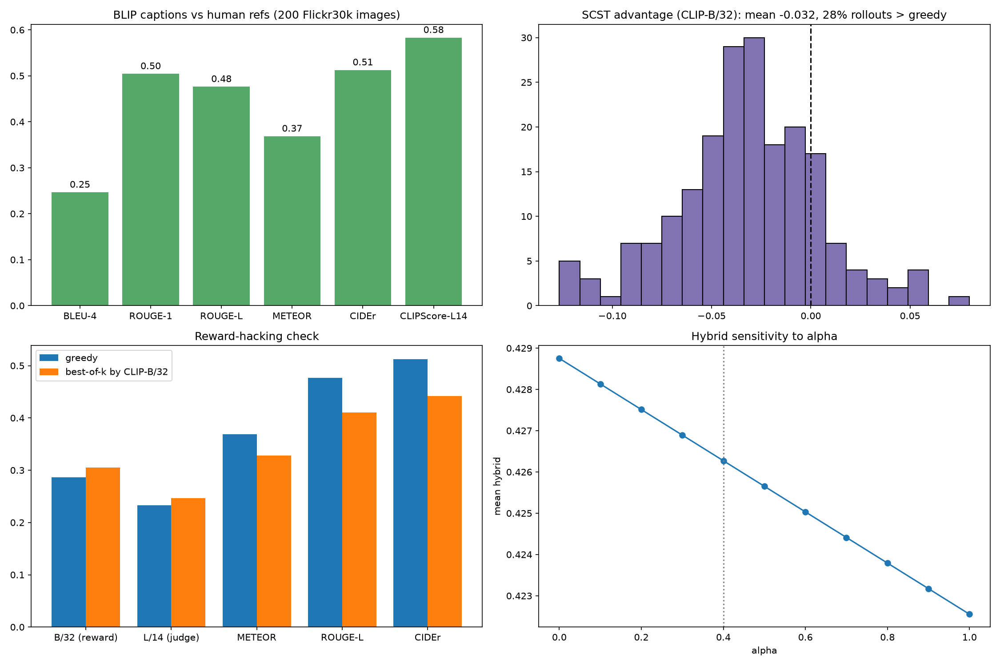
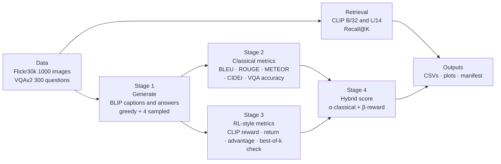
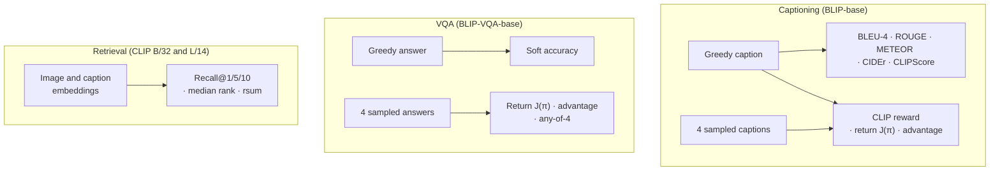
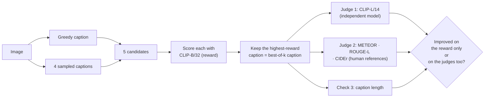
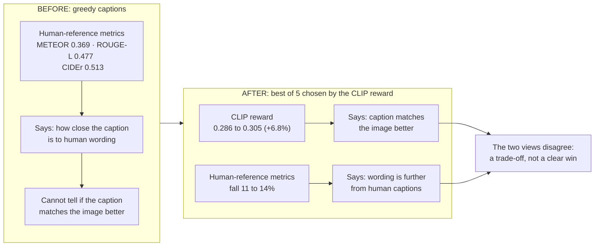

# VLM Evaluation: Benchmarks + Reward-Based (RL-Style) Metrics

## 1. What this project is about

**Goal:** evaluate vision-language models (VLMs) in a fair, reproducible way on three established tasks (image captioning, visual question answering, image-text retrieval), and check whether an **image-text reward** (CLIP, the kind of signal used in RL for captioning) agrees with **classical human-reference metrics** (BLEU, ROUGE, METEOR, CIDEr, VQA accuracy).

**Questions we answer:**

1. How well do the models do on captioning, VQA and retrieval?
2. Is sampling better than greedy decoding, or is there reward headroom that RL-style training or best-of-k selection could use?
3. If we pick captions using the CLIP reward, do they really get better, or do they only look better to that one reward? (reward-hacking check)
4. Does the CLIP reward agree with human-reference metrics?

> **Note:** no model is trained or fine-tuned here. "RL-based" means the RL quantities (reward, return, advantage) are **measured on frozen models**. The results tell us *where* an optimization would help and what risk it carries, not the effect of training.

**What this project supports, and what it does not claim**

| Supports                                                                                                                               | Does not claim                                                                                                                          |
| -------------------------------------------------------------------------------------------------------------------------------------- | --------------------------------------------------------------------------------------------------------------------------------------- |
| A systematic evaluation of a captioner, a VQA model and two CLIP retrieval models on established benchmarks, with confidence intervals | Any training or fine-tuning of a model                                                                                                  |
| RL-style quantities (reward, return, advantage) and a best-of-k reward-hacking test used as evaluation tools                           | That CLIP is a perfect judge of caption quality                                                                                         |
| A reproducible pipeline (seed, run manifest, model commit hash)                                                                        | Results comparable with published tables, or a comparison across many VLM architectures (one captioner and one VQA model are evaluated) |



---

## 2. Pipeline

### Data used

| Dataset                | Items                      | What the data is about                                                     | What the model does                           | How it is scored                                                                |
| ---------------------- | -------------------------- | -------------------------------------------------------------------------- | --------------------------------------------- | ------------------------------------------------------------------------------- |
| Flickr30k (captioning) | 200 images                 | Everyday photos of people and scenes, each with 5 human-written captions   | BLIP writes one caption per image             | BLEU-4, ROUGE, METEOR, CIDEr against the human captions; CLIP image-text scores |
| Flickr30k (retrieval)  | 1000 images, 5000 captions | Same photos and captions                                                   | CLIP embeds images and texts, then ranks them | Recall@1/5/10 and median rank, image to text and text to image                  |
| VQAv2 (validation)     | 300 questions              | Questions about images (yes/no, number, other), each with 10 human answers | BLIP-VQA answers the question                 | Soft accuracy against the human answers                                         |

### Overview



### What is measured on each task



### The reward and the reward-hacking check

Two different CLIP models play two different roles, so the reward is never judged by itself:

- **CLIP ViT-B/32 = the reward.** Reward = cosine similarity between the image and the caption.
- **CLIP ViT-L/14 = the independent judge.** Never used as a reward.



Self-critical advantage, as in the LLM part: `A = r(sampled) − r(greedy)`. Negative means greedy is already better than the average sample.

### Rewards used

| Task       | Reward                                                                         |
| ---------- | ------------------------------------------------------------------------------ |
| Captioning | CLIP-B/32 cosine similarity between the image and the caption                  |
| VQA        | Rule-based soft accuracy:`min(number of humans who gave that answer / 3, 1)` |
| Retrieval  | No reward, it is evaluated with Recall@K                                       |

### Hybrid score

`Hybrid = 0.4 · mean(ROUGE-L, METEOR) + 0.6 · normalised CLIP reward`, computed per image on the greedy captions. The notebook also sweeps α from 0 to 1.

Reproducibility: seed 42, every setting, library version and the captioner's commit hash saved in `run_manifest.json`, 95% bootstrap CIs on all means.

---

## 3. Models and results

### Models

| Model                                                 | Role                                           |
| ----------------------------------------------------- | ---------------------------------------------- |
| BLIP-base (`Salesforce/blip-image-captioning-base`) | Captioning (the "policy" being evaluated)      |
| BLIP-VQA-base (`Salesforce/blip-vqa-base`)          | Visual question answering                      |
| CLIP ViT-B/32 (`openai/clip-vit-base-patch32`)      | Retrieval model and**reward**            |
| CLIP ViT-L/14 (`openai/clip-vit-large-patch14`)     | Retrieval model and**independent judge** |

Sampling settings: 4 samples, temperature 1.0, top-p 0.9.

### Captioning (200 Flickr30k images, greedy decoding)

| Metric                              | Score         |
| ----------------------------------- | ------------- |
| BLEU-4                              | 0.247         |
| ROUGE-1 / ROUGE-L                   | 0.505 / 0.476 |
| METEOR                              | 0.369         |
| CIDEr                               | 0.513         |
| CLIPScore (B/32) / CLIPScore (L/14) | 0.715 / 0.583 |

### RL-style metrics for captioning

Mean [95% bootstrap CI].

| Metric                                                   | Value                      |
| -------------------------------------------------------- | -------------------------- |
| Greedy reward (CLIP-B/32)                                | 0.2860 [0.2806, 0.2912]    |
| Expected return J(π) (4 sampled captions)               | 0.2544 [0.2502, 0.2585]    |
| SCST advantage                                           | -0.0316 [-0.0367, -0.0266] |
| % of sampled captions beating greedy                     | 27.8%                      |
| Reward std across rollouts                               | 0.0328                     |
| Spearman (reward vs METEOR / ROUGE-L / CIDEr, per image) | 0.41 / 0.35 / 0.47         |
| Hybrid score (α = 0.4)                                  | 0.4263 [0.4068, 0.4457]    |

### Retrieval (1000 images, 5 captions each)

| Model                   | i2t R@1         | i2t R@5         | i2t R@10        | t2i R@1         | t2i R@5         | t2i R@10        | Median rank | rsum             |
| ----------------------- | --------------- | --------------- | --------------- | --------------- | --------------- | --------------- | ----------- | ---------------- |
| CLIP ViT-B/32           | 76.90           | 95.90           | 98.30           | 59.76           | 84.42           | 90.78           | 1           | 506.06           |
| **CLIP ViT-L/14** | **84.50** | **97.50** | **99.20** | **66.22** | **88.56** | **92.90** | 1           | **528.88** |

i2t = image to text, t2i = text to image, rsum = sum of the six recall values.

### VQAv2 (300 questions)

| Metric                                    | Value                   |
| ----------------------------------------- | ----------------------- |
| Accuracy (greedy)                         | 0.847 [0.808, 0.883]    |
| Expected return J(π) (4 sampled answers) | 0.711 [0.675, 0.750]    |
| SCST advantage                            | -0.136 [-0.168, -0.103] |
| Any-of-4 sampled answers correct (oracle) | 0.882 [0.848, 0.916]    |

| Answer type | Questions | Greedy accuracy |
| ----------- | --------- | --------------- |
| yes/no      | 111       | 0.964           |
| other       | 149       | 0.828           |
| number      | 40        | 0.592           |

### Best-of-k reward-hacking check

For each image, the best of 5 captions (greedy + 4 samples) is chosen by the CLIP-B/32 reward, then compared with greedy. The chosen caption differs from the greedy one for 136 of the 200 images (68%).

| Metric                               | Greedy | Best-of-k by reward | Change           |
| ------------------------------------ | ------ | ------------------- | ---------------- |
| CLIP-B/32 cosine (optimised reward)  | 0.2860 | 0.3054              | +0.0193 (+6.8%)  |
| CLIP-L/14 cosine (independent judge) | 0.2333 | 0.2467              | +0.0134 (+5.7%)  |
| METEOR (human references)            | 0.3686 | 0.3282              | -0.0405 (-11.0%) |
| ROUGE-L (human references)           | 0.4765 | 0.4100              | -0.0665 (-14.0%) |
| CIDEr (human references)             | 0.5128 | 0.4423              | -0.0705 (-13.7%) |
| Average caption length (words)       | 6.70   | 7.82                | +1.12 (+16.6%)   |


Examples from `vlm_caption_per_sample.csv` (greedy caption vs best-of-k caption):

| Greedy                  | Best-of-k by reward                              |
| ----------------------- | ------------------------------------------------ |
| a metal tower           | there is a man on a telephone high up in the sky |
| a woman on a skateboard | young girl riding a skateboard in the parking    |
| a group of dancers      | four women is performing in a dance studio       |
| a man on a ladder       | a man on a building holding a saw                |

---

## 4. What happened: does optimising the CLIP reward help?

**What this test is.** No model weights change. The "before" is greedy decoding. The "after" is choosing, for each image, the caption the CLIP reward likes best among 5 candidates. This mimics what RL training against that reward would push the model toward, and the check asks whether the improvement is real or only seen by the reward itself.

**Result in one picture:** the reward goes up, the independent judge goes up a little less, and every human-reference metric goes down.



**What happened:**

1. **The optimised reward rises** (+6.8%). Selecting by reward works, because the reward varies between candidates (std 0.033) and there are candidates that beat greedy.
2. **Most of that gain shows up on the independent judge** (CLIP-L/14, +5.7%, so about 70% of the gain transfers). So it is not only the B/32 model fooled: the captions really are more aligned with the images according to a second, stronger CLIP model.
3. **Human-reference metrics fall by 11 to 14%.** The chosen captions agree less with how people described the images.
4. **Captions get longer** (6.7 to 7.8 words). The examples above show more detailed, differently worded captions.

**How to read this.** Optimising the CLIP reward trades agreement with human wording for CLIP alignment. That is a classic warning sign of reward over-optimisation, but the evidence does not prove the captions got worse:

- n-gram metrics (METEOR, ROUGE, CIDEr) penalise correct captions that use different words from the 5 references, so part of the drop is expected when captions become longer and more specific.
- CLIP-L/14 is a stronger model from the same family as the reward (CLIP-B/32), so it is not fully independent. Both may share the same biases.
- The captions were not read by a person, and some chosen captions are visibly odd ("plants to grow inside an open chicken coop" for a girl in a pink dress).

The safe claim is: **the reward and the human-reference metrics do not move together, so CLIP alone should not be used as the only optimisation target.**

---

## 5. Interpretation: what the numbers mean

**1. Retrieval: the larger CLIP is clearly better.**
CLIP ViT-L/14 beats ViT-B/32 on every recall value (rsum 528.9 vs 506.1, image-to-text R@1 84.5 vs 76.9). This is also why L/14 is a sensible independent judge: it is the stronger model.

**2. Greedy decoding beats sampling on captions.**
The self-critical advantage is negative (-0.032) and only 27.8% of sampled captions beat greedy. At temperature 1.0 sampling adds noise, so greedy is a strong baseline, the same pattern as in the LLM evaluation.

**3. There is still reward headroom.**
Even though the average sample is worse than greedy, the best of 5 candidates has a clearly higher reward (0.305 vs 0.286). Some samples are much better, they are just not the typical ones. This is what best-of-k selection or RL training can exploit.

**4. But that headroom comes with a cost on human-reference metrics.**
See section 4: reward +6.8%, judge +5.7%, human-reference metrics -11% to -14%. This is the main finding of the VLM evaluation.

**5. The CLIP reward is only a partial proxy for human agreement.**
Its per-image rank correlation with METEOR, ROUGE-L and CIDEr is 0.35 to 0.47: related, but far from the same thing. If a model were trained on this reward alone, we should expect it to drift from human-style captions.

**6. VQA is already strong, so there is little headroom.**
Greedy accuracy is 0.847, sampling is worse (0.711), and even an oracle that always picks a correct sampled answer only reaches 0.882 (+3.5 points). Compared with the LLM math task, where best-of-4 was far above greedy, there is not much for RL or best-of-k to gain here.

**7. VQA is weakest on counting.**
"Number" questions score 0.592 against 0.964 for yes/no. Only 40 number questions were used, so this estimate is uncertain, but the direction (counting is hardest) is expected.

**8. The hybrid score is flat here because only one model is scored.**
It moves only from 0.4287 (α = 0) to 0.4226 (α = 1), and with one model there is nothing to rank. It becomes useful when several models are compared with the same pooled normalisation.

### Bottom line

| Finding                                                  | Practical meaning                                                  |
| -------------------------------------------------------- | ------------------------------------------------------------------ |
| CLIP-L/14 better than CLIP-B/32 on all retrieval metrics | Larger contrastive model, and a reasonable independent judge       |
| Negative advantage on captions (-0.032)                  | Greedy is a strong baseline, sampling is not a free win            |
| Best-of-5 raises the reward by 6.8%                      | There is exploitable reward headroom                               |
| Judge +5.7% but human-reference metrics -11% to -14%     | Reward and human agreement diverge, so avoid optimising CLIP alone |
| Reward-reference Spearman 0.35 to 0.47                   | CLIP reward is a partial proxy                                     |
| VQA any-of-4 only +3.5 points over greedy                | Little headroom left on VQA                                        |

### Caveats

- Small samples (200 captioning images, 300 VQA questions, 40 number questions): treat differences inside the CIs as noise.
- The 1000-image retrieval pool is the **first 1000 images of the dataset, not the Karpathy 1K test split**, and CIDEr's IDF is computed on the evaluated subset, so numbers are **not comparable with published tables**.
- The VQA accuracy is the simplified `min(count/3, 1)` version, not the official 10-choose-9 average.
- SPICE is not computed (it needs Java and Stanford CoreNLP). CLIPScore covers the reference-free side.
- The independent judge is from the same model family as the reward, and the captions were not checked by human reading.

---

## 6. Files and how to run

| File                                 | Content                                                                                 |
| ------------------------------------ | --------------------------------------------------------------------------------------- |
| `2_vlm_evaluation_gpu.ipynb`       | Full pipeline code                                                                      |
| `vlm_results.json`                 | All summary numbers                                                                     |
| `vlm_caption_per_sample.csv`       | Per image: greedy and best-of-k captions, reference, reward, advantage, hybrid, metrics |
| `vlm_vqa_per_sample.csv`           | Per question: answer type, accuracy, return, advantage, any-of-4                        |
| `vlm_retrieval.csv`                | Retrieval recalls for CLIP B/32 and L/14                                                |
| `vlm_best_of_k_reward_hacking.csv` | Greedy vs best-of-k on each metric                                                      |
| `RESULTS_vlm.md`                   | Compact results                                                                         |
| `run_manifest.json`                | Config, library versions, model commit                                                  |
| `vlm_evaluation_plots.png`         | The four summary plots                                                                  |

```bash
pip install torch torchvision --index-url https://download.pytorch.org/whl/cu128   # RTX 50-series needs CUDA 12.8+
pip install transformers datasets accelerate sacrebleu rouge-score nltk bert-score pycocoevalcap scipy pandas matplotlib
jupyter notebook 2_vlm_evaluation_gpu.ipynb
```

Tested on an NVIDIA RTX 5070 Laptop GPU, Python 3.13, PyTorch 2.11. Outputs go to `outputs_vlm/`.
