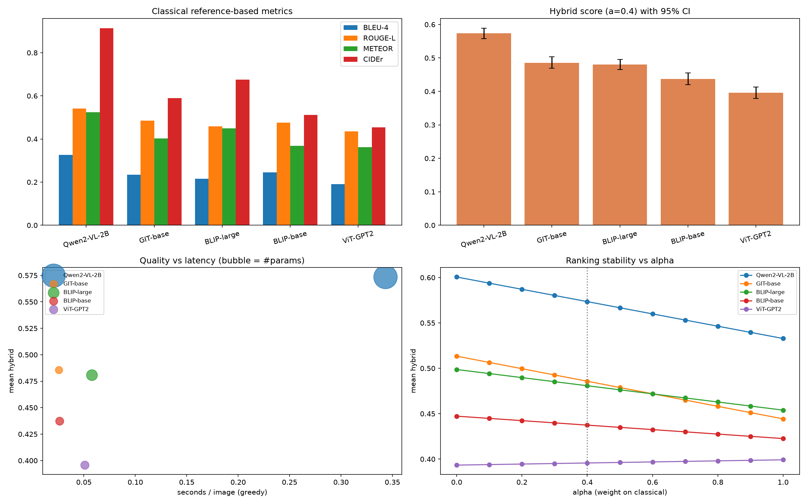
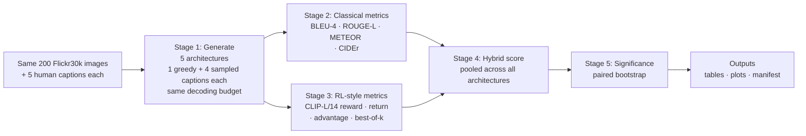
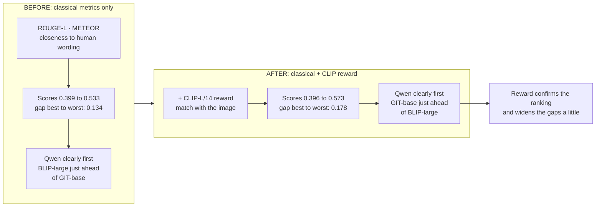
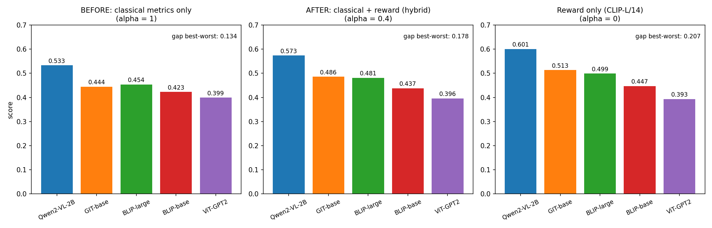
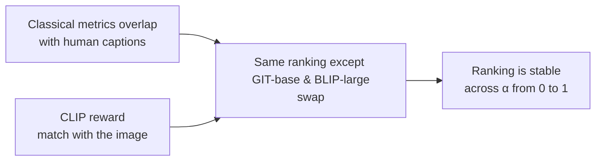

# Comparative Evaluation of VLM Architectures (Classic Encoder-Decoders vs an LLM-Based VLM)

## 1. What this project is about

**Goal:** compare five image-captioning architectures in one fair, reproducible pipeline. Everything is identical for every model (images, decoding, metrics, judge). **Only the architecture changes.**

The five architectures range from classic vision-encoder + small-decoder models to a modern **LLM-based VLM** (Qwen2-VL-2B, a vision encoder connected to a Qwen2 language model).

**Questions we answer:**

1. Which architecture writes the best captions?
2. Do classical metrics (BLEU, ROUGE, METEOR, CIDEr) and the CLIP reward agree on the ranking?
3. Is the best model really better, or is the gap just noise? (paired bootstrap)
4. What does the quality cost in speed, memory and size?
5. Is sampling better than greedy decoding, and how much reward headroom does each architecture have?

> **Note:** no model is trained or fine-tuned here. "RL-based" means reward, return and advantage are **measured on frozen models**.

**What this project supports, and what it does not claim**

| Supports                                                                                                            | Does not claim                                                                                                 |
| ------------------------------------------------------------------------------------------------------------------- | -------------------------------------------------------------------------------------------------------------- |
| A controlled comparison of 5 architectures on the same 200 images, with confidence intervals and significance tests | That architecture alone explains the differences: size, training data and prompting also differ between models |
| Quality measured with classical metrics, a CLIP reward and a hybrid score, plus latency, VRAM and parameters        | That CLIP is a perfect judge of caption quality                                                                |
| A reproducible pipeline (seed, manifest, model commit hashes, cached generations)                                   | Results comparable with published tables                                                                       |



---

## 2. Pipeline

### Data used

| Dataset   | Items                            | What the data is about                                                   | What the models do          | How it is scored                                                                 |
| --------- | -------------------------------- | ------------------------------------------------------------------------ | --------------------------- | -------------------------------------------------------------------------------- |
| Flickr30k | 200 images (same for all models) | Everyday photos of people and scenes, each with 5 human-written captions | Write one caption per image | BLEU-4, ROUGE-L, METEOR, CIDEr against the human captions; CLIP image-text score |

### One pipeline, only the architecture changes



### What is identical for every architecture

| Item                  | Setting                                                                                       |
| --------------------- | --------------------------------------------------------------------------------------------- |
| Images and references | Same 200 Flickr30k images, same text normalisation                                            |
| Baseline decoding     | Greedy, max 30 new tokens, no beam search                                                     |
| Rollouts              | 4 samples per image, temperature 1.0, top-p 0.9                                               |
| Reward and judge      | CLIP ViT-L/14 cosine similarity between image and caption (CLIP ViT-B/32 as a second opinion) |
| Hybrid normalisation  | Pooled across all architectures, so scores are comparable                                     |

The only special case is Qwen2-VL-2B, which is instruction-tuned and needs a prompt: *"Write a one-sentence caption for this image."*

### Rewards and scores

- **Reward:** cosine similarity between the image and the caption (CLIP-L/14).
- **Expected return J(π):** mean reward over the 4 sampled captions.
- **Self-critical advantage:** `A = r(sampled) − r(greedy)`. Negative means greedy is better than the average sample.
- **Best-of-k reward:** reward of the best of the 5 candidates (greedy + 4 samples).
- **Hybrid score:** `0.4 · mean(ROUGE-L, METEOR) + 0.6 · normalised CLIP reward`, computed per image. The notebook sweeps α from 0 to 1 to check whether the ranking changes.


Reproducibility: seed 42, all settings, library versions and model commit hashes saved in `run_manifest.json`. Speed is measured after an untimed warm-up run.

---

## 3. Models and results

### Models

| Architecture                   | Vision side → language side                                     | Params (M) |
| ------------------------------ | ---------------------------------------------------------------- | ---------- |
| **Qwen2-VL-2B-Instruct** | Native-resolution ViT → Qwen2 LLM (instruction-tuned, prompted) | 2209.0     |
| GIT-base (COCO)                | CLIP-style ViT → single Transformer decoder                     | 176.6      |
| BLIP-large                     | Larger ViT → BERT-style decoder                                 | 446.3      |
| BLIP-base                      | ViT → BERT-style decoder                                        | 224.0      |
| ViT-GPT2                       | ViT → GPT-2                                                     | 239.2      |

BLIP-2 is supported by the notebook but switched off in this run. No architecture failed.

### Quality results (greedy captions)

| Architecture          | BLEU-4          | ROUGE-L         | METEOR          | CIDEr           | CLIP-L/14 cosine               | Hybrid (α=0.4)                |
| --------------------- | --------------- | --------------- | --------------- | --------------- | ------------------------------ | ------------------------------ |
| **Qwen2-VL-2B** | **0.326** | **0.542** | **0.524** | **0.914** | **0.279** [0.274, 0.284] | **0.573** [0.558, 0.589] |
| GIT-base              | 0.235           | 0.485           | 0.403           | 0.590           | 0.253 [0.248, 0.258]           | 0.486 [0.469, 0.503]           |
| BLIP-large            | 0.215           | 0.458           | 0.450           | 0.676           | 0.249 [0.243, 0.254]           | 0.481 [0.466, 0.496]           |
| BLIP-base             | 0.245           | 0.476           | 0.369           | 0.511           | 0.234 [0.228, 0.239]           | 0.437 [0.420, 0.455]           |
| ViT-GPT2              | 0.191           | 0.436           | 0.362           | 0.454           | 0.218 [0.212, 0.223]           | 0.396 [0.379, 0.413]           |

Mean [95% bootstrap CI]. Second opinion: CLIP-B/32 cosine gives the same order (0.324, 0.305, 0.299, 0.286, 0.278).

### RL-style metrics

| Architecture | J(π) return         | SCST advantage          | % samples beating greedy | Reward std | Best-of-5 reward | Avg words |
| ------------ | -------------------- | ----------------------- | ------------------------ | ---------- | ---------------- | --------- |
| Qwen2-VL-2B  | 0.269 [0.265, 0.274] | -0.010 [-0.013, -0.006] | 40.6                     | 0.023      | 0.301            | 12.4      |
| GIT-base     | 0.226 [0.222, 0.230] | -0.027 [-0.032, -0.021] | 30.1                     | 0.030      | 0.273            | 8.9       |
| BLIP-large   | 0.223 [0.219, 0.227] | -0.025 [-0.030, -0.020] | 30.4                     | 0.031      | 0.270            | 11.8      |
| BLIP-base    | 0.196 [0.192, 0.200] | -0.037 [-0.043, -0.032] | 25.2                     | 0.034      | 0.252            | 6.7       |
| ViT-GPT2     | 0.208 [0.204, 0.213] | -0.009 [-0.013, -0.006] | 40.9                     | 0.024      | 0.243            | 9.7       |

### Cost

| Architecture | Seconds / image | Peak VRAM (GiB) | Params (M) |
| ------------ | --------------- | --------------- | ---------- |
| Qwen2-VL-2B  | 0.343           | 4.49            | 2209.0     |
| GIT-base     | 0.026           | 0.41            | 176.6      |
| BLIP-base    | 0.026           | 0.64            | 224.0      |
| ViT-GPT2     | 0.051           | 0.56            | 239.2      |
| BLIP-large   | 0.058           | 1.09            | 446.3      |

### Example captions (same image, greedy)

|                 | Image 1                                                                                    | Image 2                                                                            |
| --------------- | ------------------------------------------------------------------------------------------ | ---------------------------------------------------------------------------------- |
| Human reference | A child in a pink dress is climbing up a set of stairs in an entry way.                    | Someone in a blue shirt and hat is standing on stair and leaning against a window. |
| Qwen2-VL-2B     | A little girl in a pink dress is standing on a wooden platform in front of a chicken coop. | A man on a ladder is working on a window.                                          |
| GIT-base        | a little girl in a pink dress and pink dress looking out of a window.                      | a man on a ladder                                                                  |
| BLIP-large      | there is a little girl that is standing on a porch                                         | araffe on a ladder climbing up to a building with a clock on the side              |
| BLIP-base       | a little girl in a pink dress                                                              | a man on a ladder                                                                  |
| ViT-GPT2        | a little girl standing next to a wooden fence                                              | a man is standing on a brick building with a window                                |

---

## 4. What the evaluation shows: before vs after adding the reward

### What "before" and "after" mean here

No model weights change. The before/after is about the **evaluation**, using the same captions:

- **Before:** score the architectures with classical metrics only (ROUGE-L and METEOR, α = 1).
- **After:** add the CLIP reward and combine both into the hybrid score (α = 0.4).

> **Important:** the captions are exactly the same in both cases. Only the measuring tool changes. Compare the **rankings and gaps**, not the raw numbers, because the reward part is on a different scale. A higher hybrid score does **not** mean a better model.





| Architecture                | Before: classical only (α=1) | After: hybrid (α=0.4)   | Reward only (α=0) |
| --------------------------- | ----------------------------- | ------------------------ | ------------------ |
| Qwen2-VL-2B                 | 0.533 (rank 1)                | **0.573** (rank 1) | 0.601              |
| GIT-base                    | 0.444 (rank 3)                | 0.486 (rank 2)           | 0.513              |
| BLIP-large                  | 0.454 (rank 2)                | 0.481 (rank 3)           | 0.499              |
| BLIP-base                   | 0.423 (rank 4)                | 0.437 (rank 4)           | 0.447              |
| ViT-GPT2                    | 0.399 (rank 5)                | 0.396 (rank 5)           | 0.393              |
| **Gap best to worst** | **0.134**               | **0.178**          | 0.207              |

**What happened:**

1. **Before, the models were already separable.** Unlike the LLM summaries, classical metrics here spread the architectures (0.399 to 0.533) and put Qwen2-VL-2B clearly first.
2. **After, the ranking is almost the same.** Qwen stays first, and BLIP-base and ViT-GPT2 stay 4th and 5th.
3. **The reward changed one thing:** GIT-base and BLIP-large swap 2nd and 3rd. The gap between them is tiny (0.010 before, 0.005 after), so they are effectively tied.
4. **The reward widens the spread** from 0.134 to 0.178 (about a third larger), because it adds the image-match view on top of word overlap.

**What this shows.** The reward does not overturn the classical ranking. It **confirms** it from a second, independent angle (image match instead of word overlap). That agreement is what makes the conclusion trustworthy: Qwen2-VL-2B is best whether we ask "how close to human wording" or "how well it matches the image".

**What this does not show.** The models did not get better, and this is not a before/after of training. In the LLM part the reward was needed to separate the models. Here it mainly serves as a check.

### Do classical metrics and the reward agree?

Ranking by each signal (best to worst):

| Signal                  | Ranking                                                    |
| ----------------------- | ---------------------------------------------------------- |
| Classical only (α = 1) | Qwen2-VL-2B > BLIP-large > GIT-base > BLIP-base > ViT-GPT2 |
| Hybrid (α = 0.4)       | Qwen2-VL-2B > GIT-base > BLIP-large > BLIP-base > ViT-GPT2 |
| Reward only (α = 0)    | Qwen2-VL-2B > GIT-base > BLIP-large > BLIP-base > ViT-GPT2 |



Two distinct rankings appear across α in [0, 1]. The only change is **GIT-base and BLIP-large swapping** when α ≥ 0.7. Qwen2-VL-2B stays first and ViT-GPT2 stays last for every α.

### Is the best model really better? (paired bootstrap on the hybrid score)

| Comparison                | Mean difference | 95% CI         | Significant |
| ------------------------- | --------------- | -------------- | ----------- |
| Qwen2-VL-2B − GIT-base   | 0.088           | [0.071, 0.105] | Yes         |
| Qwen2-VL-2B − BLIP-large | 0.093           | [0.078, 0.107] | Yes         |
| Qwen2-VL-2B − BLIP-base  | 0.136           | [0.118, 0.155] | Yes         |
| Qwen2-VL-2B − ViT-GPT2   | 0.178           | [0.158, 0.197] | Yes         |

All intervals are above zero, so Qwen2-VL-2B's lead is not noise.

---

## 5. Interpretation: what the numbers mean

**1. Qwen2-VL-2B is the best architecture on every measure.**
It leads all classical metrics, the CLIP reward, the expected return and the hybrid score, and its lead over every other model is statistically significant.

**2. The ranking is robust.**
Classical metrics and the CLIP reward tell nearly the same story. Only GIT-base and BLIP-large swap places, and their hybrid scores are close (0.486 vs 0.481, overlapping intervals), so treat them as tied.

**3. Quality has a price.**
Qwen2-VL-2B is about 12 times larger and 13 times slower than GIT-base (0.343 vs 0.026 seconds per image) and uses 4.49 GiB of VRAM instead of 0.41. GIT-base reaches about 85% of Qwen's hybrid score at a fraction of the cost, so it is the efficient choice.

**4. Sampling does not beat greedy decoding for any architecture.**
The advantage is negative for all five (-0.009 to -0.037), and only 25% to 41% of sampled captions beat greedy. This is the same pattern as in the LLM and single-VLM evaluations.

**5. Architecture matters more than picking the best sample.**
Qwen's greedy reward (0.279) is higher than the best-of-5 reward of every other architecture (at most 0.273). Choosing among samples cannot make up for a weaker model.

**6. Every architecture has some reward headroom.**
Best-of-5 improves the CLIP reward by about 0.018 to 0.025 for all models. The gain is similar across architectures.

**7. Bigger is better within the BLIP family, but not on every metric.**
BLIP-large beats BLIP-base on METEOR (0.450 vs 0.369), CIDEr (0.676 vs 0.511) and CLIP reward, but scores lower on BLEU-4 and ROUGE-L. BLIP-large also produces odd wording in places (for example "araffe on a ladder").

**8. Qwen writes longer, more detailed captions and still scores best.**
Its captions average 12.4 words against 6.7 for BLIP-base. Longer captions can be penalised by n-gram metrics, but Qwen still leads them. Its output does depend on the prompt used.

### Bottom line

| Finding                                                                                          | Practical meaning                                   |
| ------------------------------------------------------------------------------------------------ | --------------------------------------------------- |
| Qwen2-VL-2B best on all metrics, significantly                                                   | The LLM-based VLM gives the best captions           |
| Before (classical only) vs after (with reward): same ranking except one swap, gap 0.134 → 0.178 | The reward confirms the ranking from a second angle |
| Only GIT-base and BLIP-large swap (α ≥ 0.7)                                                    | These two are effectively tied                      |
| Qwen is 13× slower, 12× larger                                                                 | Best quality costs a lot of compute                 |
| GIT-base gets about 85% of the score at 0.4 GiB                                                  | Best efficiency choice                              |
| Negative advantage for all five                                                                  | Greedy is a strong baseline                         |
| Qwen greedy beats others' best-of-5                                                              | Model choice matters more than sample selection     |

### Caveats

- Small sample: 200 images. Latency was measured on one laptop GPU with batch size 8, so speeds are not portable.
- BLIP, GIT and ViT-GPT2 were tuned on COCO captions and evaluated on Flickr30k, an out-of-domain setting for them.
- The models differ in size, training data and prompting, so the gaps are not caused by architecture alone.
- The reward and the judge are the same CLIP-L/14. CLIP-B/32 agrees on the ranking, but it is from the same family, and no human checked the captions.
- Best-of-k headroom was measured on the reward only. Whether the selected captions also match human wording was checked only for BLIP-base in the VLM evaluation, where it dropped.
- Numbers are not comparable with published leaderboards (subset, CIDEr IDF computed on the 200 images).

---

## 6. Files and how to run

| File                                          | Content                                                                 |
| --------------------------------------------- | ----------------------------------------------------------------------- |
| `3_comparative_vlm_architectures_gpu.ipynb` | Full pipeline code                                                      |
| `comparative_results.csv`                   | Full results table, one row per architecture                            |
| `comparative_per_sample.csv`                | Per image and architecture: caption, metrics, reward, advantage, hybrid |
| `comparative_alpha_sensitivity.csv`         | Hybrid score for α from 0 to 1                                         |
| `comparative_significance.csv`              | Paired bootstrap tests                                                  |
| `RESULTS_comparative.md`                    | Compact results                                                         |
| `run_manifest.json`                         | Config, library versions, model commits                                 |
| `comparative_plots.png`                     | The four summary plots                                                  |

```bash
pip install torch torchvision --index-url https://download.pytorch.org/whl/cu128   # RTX 50-series needs CUDA 12.8+
pip install transformers datasets accelerate sacrebleu rouge-score nltk bert-score pycocoevalcap scipy pandas matplotlib
jupyter notebook 3_comparative_vlm_architectures_gpu.ipynb
```

Tested on an NVIDIA RTX 5070 Laptop GPU, Python 3.13, PyTorch 2.11. Outputs go to `outputs_comparative/`.
