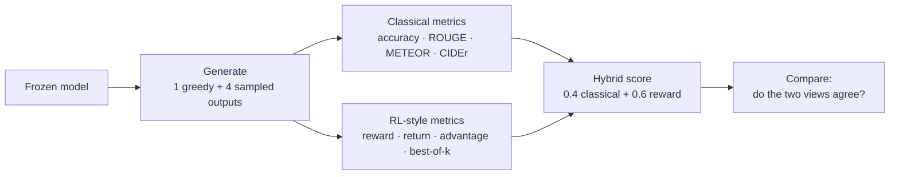
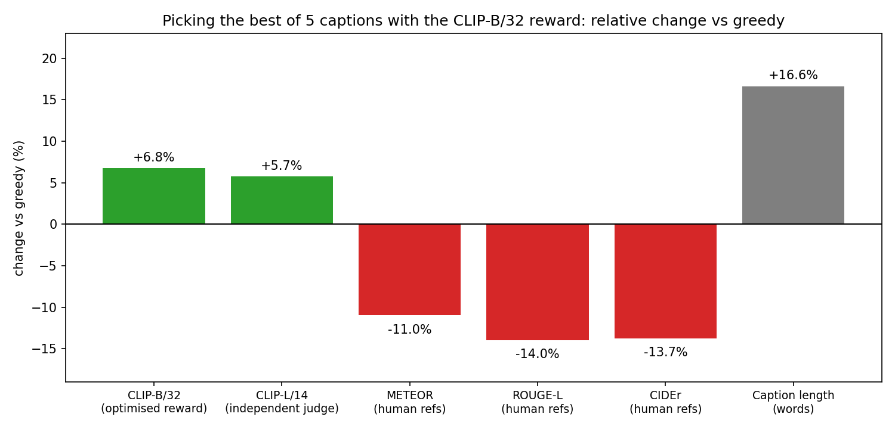

# Evaluating LLMs and VLMs with Benchmarks and RL-Style Metrics

We evaluated small open **LLMs** and **vision-language models (VLMs)** on established benchmarks, and asked one question throughout: **does a reward signal tell us something that classical metrics (BLEU, ROUGE, METEOR, CIDEr, accuracy) do not?**

> **No model was trained.** Rewards, returns and advantages are "RL-style" quantities measured on **frozen models**, used as evaluation tools.

---

## The project at a glance

| Part                         | What was evaluated                                     | Data                                                             | Reward used                                                    |
| ---------------------------- | ------------------------------------------------------ | ---------------------------------------------------------------- | -------------------------------------------------------------- |
| **1. LLM**             | Qwen2.5-1.5B, Qwen2.5-0.5B, SmolLM2-360M, SmolLM2-135M | GSM8K (math), ARC-Challenge (science), CNN/DailyMail (summaries) | Answer correctness (GSM8K), a learned reward model (summaries) |
| **2. VLM**             | BLIP (captioning), BLIP-VQA, CLIP (retrieval)          | Flickr30k, VQAv2                                                 | CLIP image-caption similarity                                  |
| **3. Comparative VLM** | Qwen2-VL-2B, GIT-base, BLIP-large, BLIP-base, ViT-GPT2 | Same 200 Flickr30k images                                        | CLIP image-caption similarity                                  |

## How every part works

- **Return J(π):** average reward of the 4 sampled outputs.
- **Advantage:** `reward(sampled) − reward(greedy)`. Negative means greedy is already better than sampling.
- **Best-of-k:** keep the highest-reward output, to measure how much room there is to improve.

Everything is reproducible: fixed seed, saved run manifest (library versions, model commits), confidence intervals on all means.

---

## Part 1: LLM evaluation

**What we did:** compared 4 small LLMs on math, science questions and summarisation, scored with classical metrics and with rewards.

| Model                  | GSM8K acc | ARC-C acc | Summary reward | Classical score | Hybrid          |
| ---------------------- | --------- | --------- | -------------- | --------------- | --------------- |
| **Qwen2.5-1.5B** | 0.56      | 0.74      | 3.33           | 0.227           | **0.534** |
| Qwen2.5-0.5B           | 0.39      | 0.38      | 2.63           | 0.224           | 0.480           |
| SmolLM2-360M           | 0.12      | 0.18      | 2.48           | 0.225           | 0.469           |
| SmolLM2-135M           | 0.03      | 0.28      | 1.02           | 0.216           | 0.356           |

**What we found**

- **Classical metrics could not tell the summaries apart** (0.216 to 0.227). The reward model separated the models clearly (1.02 to 3.33).
- **Qwen2.5-1.5B is the best model** on every measure, and SmolLM2-135M is the worst. The reward-based ranking matches the GSM8K accuracy ordering.
- **Headroom exists for the strongest model only:** best-of-4 on GSM8K is 0.82 against 0.56 greedy, and majority voting gives 0.68. Smaller models gain nothing.
- **Sampling never beats greedy on summaries** (advantage is negative for all models).
- **The reward model is a weak proxy** (agreement with GSM8K correctness: AUC 0.52 to 0.76), so optimising against it would be risky.

---

## Part 2: VLM evaluation (BLIP + CLIP)

**What we did:** evaluated captioning, VQA and retrieval, then picked the best of 5 captions with the CLIP reward and checked whether it really improves.

| Task             | Result                                          |
| ---------------- | ----------------------------------------------- |
| Retrieval (rsum) | CLIP-L/14**528.9** vs CLIP-B/32 506.1     |
| VQA accuracy     | 0.847 (any of 4 sampled answers correct: 0.882) |
| Captioning       | CIDEr 0.513, METEOR 0.369                       |

**What we found**

- **The reward and human-reference metrics disagree.** Picking captions by CLIP reward raised CLIP scores (+6.8%, and +5.7% on an independent CLIP judge) but lowered METEOR, ROUGE-L and CIDEr by 11% to 14%.
- **Meaning:** the CLIP reward measures how well a caption matches the image, while the human-reference metrics measure closeness to human wording. Optimising CLIP alone trades one for the other.
- **VQA has little headroom** (greedy 0.847, best sampled answer 0.882), and counting questions are weakest (0.592).
- **Greedy beats sampling** for captions (advantage -0.032).

---

## Part 3: Comparative VLM architectures

**What we did:** ran 5 captioning architectures, from classic encoder-decoders to the LLM-based Qwen2-VL-2B, through one identical pipeline on the same 200 images.

| Architecture          | Hybrid score    | Classical only | Seconds / image |
| --------------------- | --------------- | -------------- | --------------- |
| **Qwen2-VL-2B** | **0.573** | 0.533          | 0.343           |
| GIT-base              | 0.486           | 0.444          | 0.026           |
| BLIP-large            | 0.481           | 0.454          | 0.058           |
| BLIP-base             | 0.437           | 0.423          | 0.026           |
| ViT-GPT2              | 0.396           | 0.399          | 0.051           |

**What we found**

- **Qwen2-VL-2B is the best architecture on every measure**, and the gap to each other model is statistically significant.
- **Here the reward confirmed the classical ranking** instead of changing it. Only GIT-base and BLIP-large swap places, and they are effectively tied.
- **Quality has a price:** Qwen2-VL-2B is about 13 times slower and 12 times larger than GIT-base, which reaches about 85% of its hybrid score.
- **Model choice beats sample selection:** Qwen's greedy reward (0.279) is higher than every other model's best-of-5 (at most 0.273).

---

## Conclusions

| Part            | What the reward showed                                                                                  |
| --------------- | ------------------------------------------------------------------------------------------------------- |
| LLM             | Classical metrics were flat, the reward separated the models: the reward**adds information**      |
| VLM             | Reward and human-reference metrics moved in opposite directions: they**measure different things** |
| Comparative VLM | Reward and classical metrics agreed: the ranking is**robust**                                     |

1. **Rewards add a second view.** They reveal differences classical metrics miss (LLM), conflict with them in informative ways (VLM), or confirm them (comparative).
2. **Bigger and better-trained models win**, but size alone is not enough (Qwen2.5-0.5B beats SmolLM2-360M on math with similar size).
3. **Greedy decoding is a strong baseline everywhere.** Sampling had a negative advantage in every experiment.
4. **Test-time selection helps only when the model is already strong** (best-of-k, majority vote), and architecture choice matters more than picking among samples.
5. **Learned rewards are imperfect proxies.** Optimising them alone risks drifting from human-style outputs, so verifiable rewards are safer.

**Wrap-up in ALL**

* **LLM:** classical metrics could not tell the models apart, but the reward model ranked them, with Qwen2.5-1.5B best according to it.
* **VLM:** the CLIP reward measures how well captions match the image, and the human-reference metrics measure how close they are to human wording, so they can disagree.
* **Comparative VLM:** across 5 captioning architectures, the CLIP reward and the classical metrics gave almost the same ranking, with Qwen2-VL-2B clearly best, at about 13 times the latency of GIT-base.
